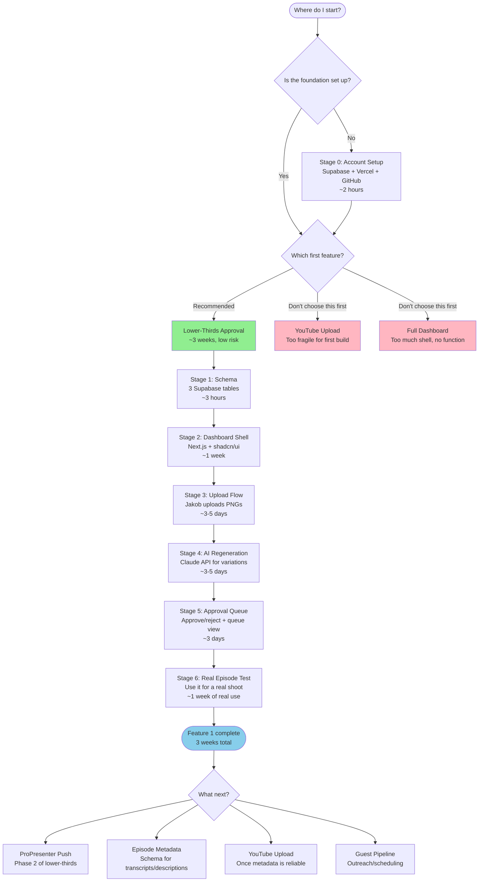
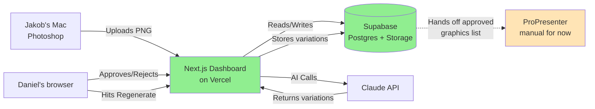
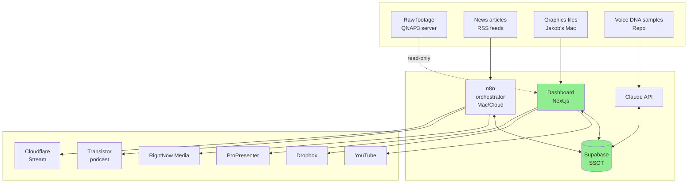

# GSR Automation Build Roadmap (Visual)

This is the visual version of the order-of-operations from START_HERE.md. GitHub renders Mermaid diagrams automatically. Click any node to follow the path.

---

## The "what to build first" decision tree

---

## The system architecture (after feature 1)

The orange ProPresenter box is the only piece that's still manual after feature 1. Phase 2 of this same feature automates it via the ProPresenter API.

---

## The full system at the end (post-feature-1 view)

This is what the system will look like later. Use it as a north star, not a TODO list.

The green boxes are where everything connects. The point: every input flows into Supabase, every output flows from it. That's why the database choice mattered.

---

## What's NOT on this diagram (by intent)

- **Notion** — not part of the system anymore. If kept, only as a human-readable doc tool, not connected to any of this.
- **Rundown Creator** — fragile dependency. Replaced or wrapped later, not now.
- **Fireside.fm** — gets swapped for Transistor when podcast distribution is built. For now, manual upload continues.
- **StreamHoster** — gets swapped for Cloudflare Stream when video distribution is built. For now, manual continues.
- **All the audit "swap" recommendations** — wait until the workflows that use them are being built.

Everything not on the diagram is a future decision. Don't decide it now.
